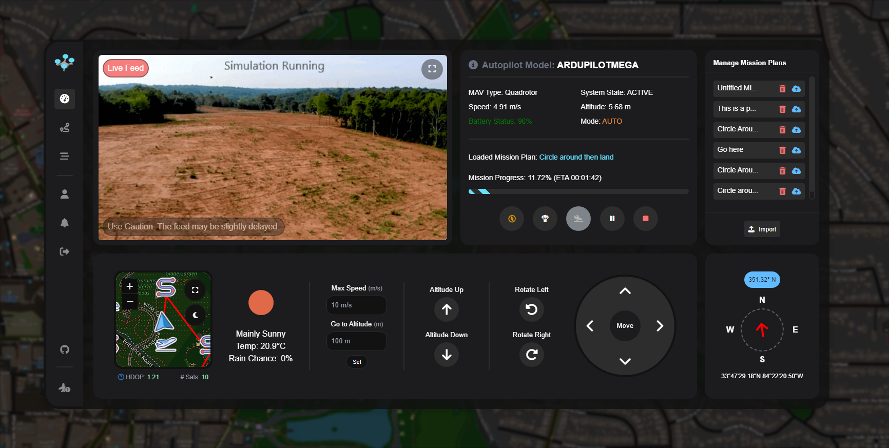
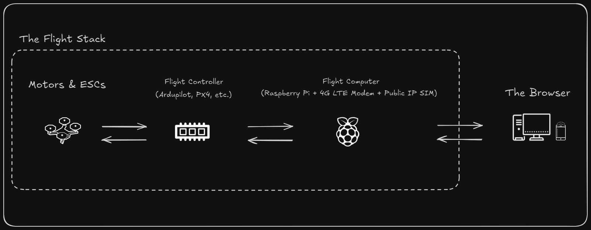

<div align="center">

# 🚁 MAV Manager GCS 📡


A web-based ground control station (GCS) for remote autopilot management via the [MAVLink protocol](https://en.wikipedia.org/wiki/MAVLink).



</div>

---

## 🤔 How Does It Work?

Unlike traditional GCS software, MAV Manager GCS is a web-based application that runs on a Raspberry Pi--making it a part of the flight stack. This enables you to manage your autopilot from anywhere in the world, as long as you have an internet connection.


---

## 🐚 Setup Script

Be sure to install all the system dependencies before trying to run the docker container. This command will run the setup script located in the contrib folder.

```bash
curl -s https://raw.githubusercontent.com/MAV-Manager/mmgcs_public/main/contrib/setup.sh | \
    bash -s --
```

<details>
<summary>👈 View Setup Script</summary>
<p>

```bash
#!/bin/bash

# Update system and install necessary packages
sudo apt-get update
sudo apt-get -y install docker.io nginx ufw wget

# Enable and start the firewall
echo "y" | sudo ufw enable
sudo ufw allow 22
sudo ufw allow 8090
sudo ufw allow 8889
sudo ufw allow 5173
sudo ufw allow in on ppp0
sudo ufw allow out on ppp0
sudo iptables -t nat -F
echo "y" | sudo ufw reload

# Turn off NetworkManager to prevent conflicts with ppp0
sudo systemctl stop NetworkManager
sudo systemctl disable NetworkManager

# Configure 4G modem
sudo tee /etc/chatscripts/lte > /dev/null << EOF
ABORT 'BUSY'
ABORT 'NO CARRIER'
ABORT 'ERROR'
TIMEOUT 12
"" 'AT'
OK 'ATZ'
OK 'AT+CGDCONT=1,"IP","simbase"'
OK 'ATD*99#'
CONNECT ''
EOF

sudo tee /etc/ppp/peers/lte > /dev/null << EOF
/dev/ttyUSB2
115200
connect "/usr/sbin/chat -v -f /etc/chatscripts/lte"
noauth
defaultroute
usepeerdns
persist
defaultroute
replacedefaultroute
EOF

sudo pon lte
sleep 5
sudo ip route del default
sudo ip route add default dev ppp0
sudo ip link set dev ppp0 mtu 1400
PUBLIC_IP=$(curl icanhazip.com)
# Export the variable for Docker Compose
echo "export PUBLIC_IP=$PUBLIC_IP" >> ~/.bashrc
source ~/.bashrc

sudo chown -R $(whoami):www-data /home/$(whoami)

DOCKER_CONFIG=${DOCKER_CONFIG:-$HOME/.docker}
# check if docker compose is installed

if command -v docker &> /dev/null && docker compose version &> /dev/null; then
    echo "docker compose command is available"
else
    echo "docker compose command is not available"
    mkdir -p $DOCKER_CONFIG/cli-plugins
    curl -SL https://github.com/docker/compose/releases/download/v2.3.3/docker-compose-linux-aarch64 -o $DOCKER_CONFIG/cli-plugins/docker-compose
    chmod +x $DOCKER_CONFIG/cli-plugins/docker-compose
fi

# May need to logout and login to apply docker group changes
if ! docker ps >/dev/null 2>&1; then
    echo "Docker installed. Adding $(whoami) to the 'docker' group..."
    sudo usermod -aG docker $(whoami)
    echo -e "User added to 'docker' group but the session must be reloaded to access the Docker daemon. Please log out, log back in, and rerun the script. Exiting..."
    exit 0
fi

sudo tee /etc/docker/daemon.json > /dev/null << EOF
{
  "iptables": true,
  "default-address-pools": [
    {"base":"172.18.0.0/16","size":24}
  ],
  "log-driver": "json-file",
  "log-opts": {
    "max-size": "10m",
    "max-file": "3"
  },
  "dns": ["8.8.8.8", "8.8.4.4"],
  "metrics-addr": "127.0.0.1:9323",
  "experimental": false,
  "live-restore": true
}
EOF

sudo systemctl restart docker

# Check and enable all uarts with dtoverlay=uartx
for uart in 0 1 2 3; do
    if ! grep -q "dtoverlay=uart${uart}" /boot/firmware/config.txt; then
        echo "dtoverlay=uart${uart}" | sudo tee -a /boot/firmware/config.txt
    fi
done
```

</p>
</details>

---

## 🐳 Installation
```bash
cd ~
rm -rf mmgcs
git clone https://github.com/MAV-Manager/mmgcs_public.git mmgcs
cd mmgcs
docker compose -f docker-compose.prod.yml down
docker system prune -f
docker compose -f docker-compose.prod.yml up -d
```
*Running `docker compose up -d` without the `-f` flag will use the default `docker-compose.yml` file. This file will load a [SiTL](https://ardupilot.org/dev/docs/sitl-simulator-software-in-the-loop.html) instance of ArduCopter for testing purposes.*

---

## 📜 License
This software is made available under a propietary End Use License Agreement. See the [`LICENSE`](LICENSE.md) file for more information.
